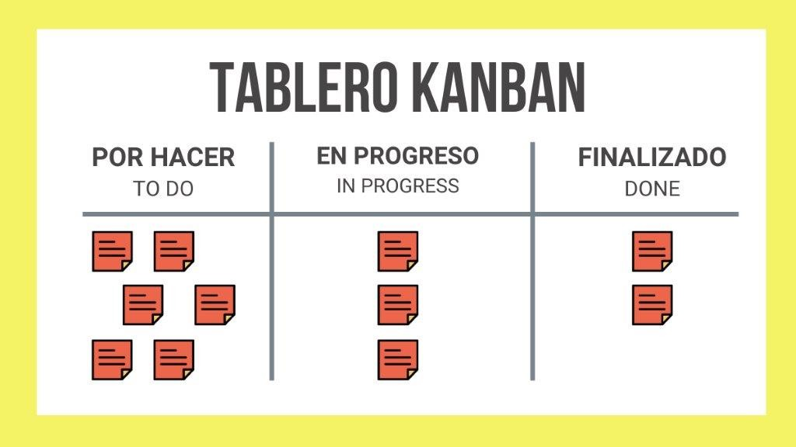

# 1. Introducción y Organización: El Arte del Trabajo Cooperativo

El trabajo en grupo es una competencia transversal esencial en la vida universitaria. No se trata simplemente de una división de tareas, sino de un proceso de "aprendizaje cooperativo" donde el éxito individual está ligado al éxito del equipo.

## 1.1 Características de un Equipo Eficaz
Para que un grupo trascienda la mera reunión de personas y se convierta en un equipo, debe poseer:
* **Objetivos comunes:** Metas claras, compartidas y aceptadas por todos.
* **Liderazgo distribuido:** Aunque exista un coordinador, cada miembro debe liderar su propia área de responsabilidad.
* **Comunicación abierta:** Un flujo de información honesto que permita resolver conflictos de forma constructiva.

## 1.2 Roles dentro de los Grupos de Trabajo
Basándonos en las dinámicas de grupos académicos, sugerimos la asignación de roles específicos para evitar la "holgazanería social":
1. **Coordinador/Moderador:** Organiza las reuniones, asegura que se cumplan los tiempos y actúa como enlace principal.
2. **Secretario/Relator:** Registra los acuerdos de cada sesión y mantiene la versión más reciente de los documentos.
3. **Crítico/Evaluador:** Cuestiona las ideas del grupo para evitar el pensamiento grupal y asegurar la calidad científica.
4. **Portavoz:** Representa al equipo ante el docente o en presentaciones públicas.

## 1.3 Fases del Desarrollo del Grupo (Modelo de Tuckman)
Es normal que el equipo pase por estas etapas:
* **Formación:** Conocimiento mutuo y fijación de reglas.
* **Conflicto (Storming):** Aparición de diferencias de opinión. Es vital para el crecimiento.
* **Normalización:** Establecimiento de normas y cohesión.
* **Desempeño:** Trabajo fluido y alta productividad.

## 1.4 Planificación y Ejecución
Un equipo organizado debe utilizar una **Matriz de Planificación** donde se detalle:
* La tarea específica.
* El responsable asignado.
* La fecha de entrega interna (al menos 48 horas antes de la oficial).

> **Recurso de consulta:** Para una visión profunda sobre las pautas de interacción, consulte el [Material Docente: Trabajo en Grupo](../referencias/guia-trabajo-grupo.pdf).