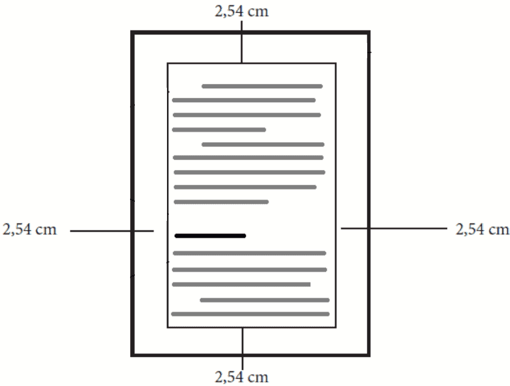
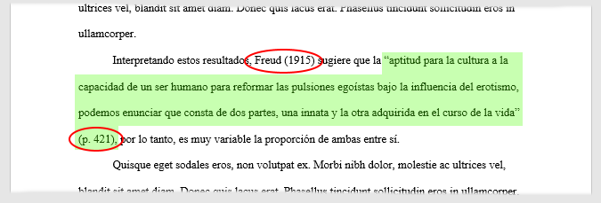
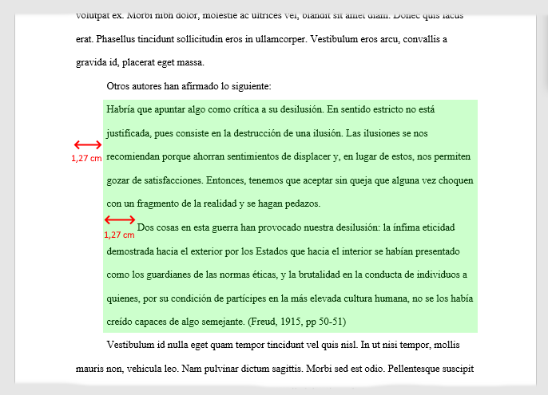
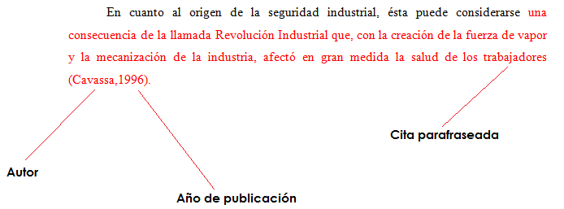
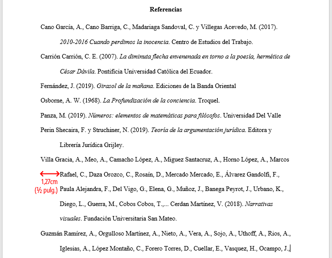

# 2. Formato, Estilo y Citación según Normas APA (7ma Edición)

La calidad de un trabajo universitario se mide no solo por su contenido, sino por el rigor con el que se presenta. Las normas de la *American Psychological Association* (APA) son el estándar internacional para la comunicación científica.

## 2.1 Formato General del Documento
Para que el trabajo tenga una apariencia profesional y cumpla con los requisitos universitarios, se debe configurar:
* **Papel:** Tamaño carta.
* **Márgenes:** 2.54 cm (1 pulgada) en todos los lados.
* **Fuentes:** Se recomiendan fuentes claras como Arial (11 pts) o Times New Roman (12 pts).
* **Interlineado:** Doble (2.0) en todo el documento, sin espacio adicional entre párrafos.
* **Alineación:** Izquierda (sin justificar), dejando el borde derecho "irregular" para facilitar la lectura.

## 2.2 Estructura del Trabajo
Un trabajo estándar debe seguir este orden:
1. **Portada:** Título, nombres de los autores, afiliación institucional (UVM), curso y fecha.
2. **Texto:** El cuerpo del trabajo organizado con niveles de encabezados claros.
3. **Referencias:** La lista completa de fuentes citadas.

## 2.3 El Sistema de Citación: Evitando el Plagio
El plagio es una falta grave. Se deben usar citas para toda idea que no sea propia:
* **Cita Textual Corta:** Menos de 40 palabras. Va entre comillas y se indica (Apellido, Año, p. número de página).

* **Cita Textual Larga:** Más de 40 palabras. Se coloca en un bloque independiente, con sangría de 1.27 cm y sin comillas.

* **Paráfrasis:** Se explica la idea del autor con nuestras palabras, pero se debe dar el crédito (Apellido, Año).

## 2.4 Lista de Referencias
A diferencia de una bibliografía, la lista de referencias solo incluye los trabajos que apoyan directamente el artículo. Deben estar ordenadas alfabéticamente y utilizar **sangría francesa**.

> **Recurso de consulta:** Para ejemplos específicos sobre cómo citar videos, redes sociales o libros, revise la [Guía Completa de Normas APA 7ma Edición](../referencias/Guia-Normas-APA-7ma-edicion.pdf).