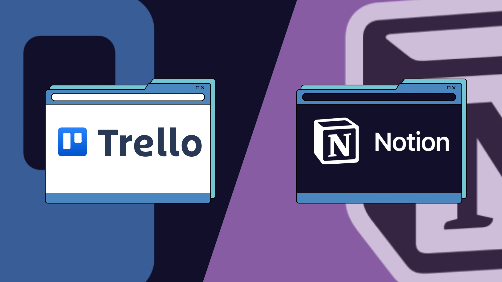
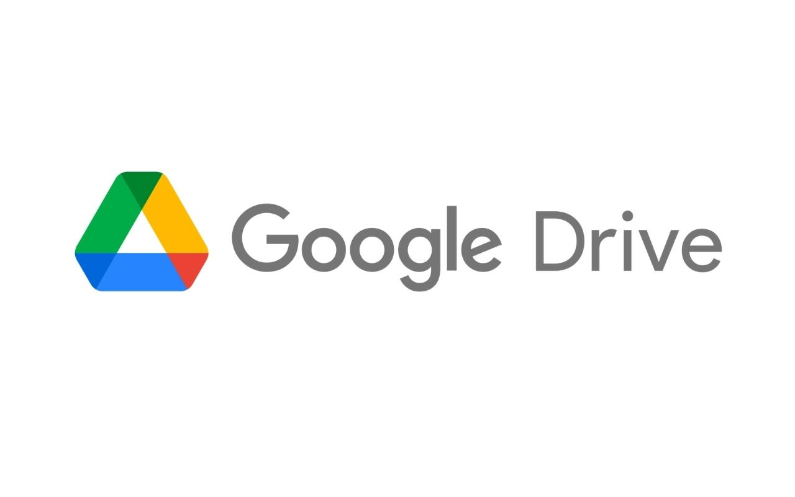
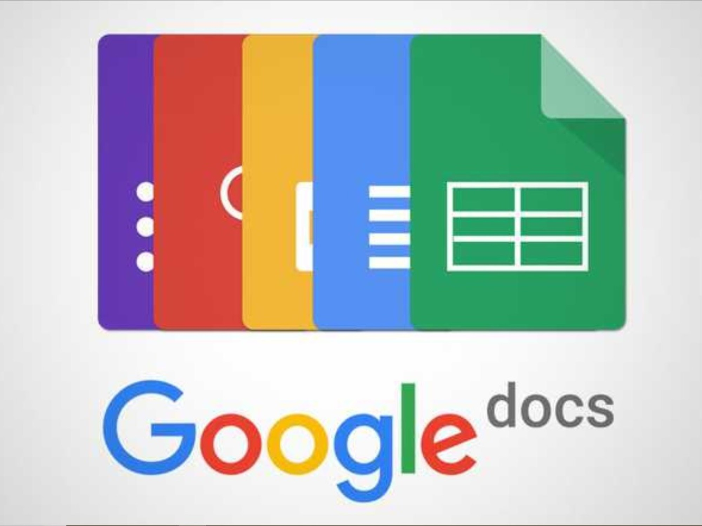

# 3. Herramientas Tecnológicas para el Trabajo Colaborativo

En la actualidad, la elección de la "stack" tecnológica adecuada es determinante para la productividad de un equipo. No se trata solo de usar muchas aplicaciones, sino de integrarlas en un flujo de trabajo coherente.

## 3.1 Gestión de Proyectos y Tareas
Para evitar la confusión sobre "quién hace qué", recomendamos:
* **GitHub Projects:** Ideal para proyectos técnicos. Permite vincular el código o los documentos directamente con las tareas (Issues).
* **Trello / Notion:** Excelentes para una gestión visual mediante tableros Kanban más amigables para usuarios no técnicos.

## 3.2 Comunicación y Repositorio de Información
Es fundamental separar la comunicación social de la comunicación de trabajo:
* **Slack o Discord:** Permiten crear canales temáticos (ej: #formato, #investigacion), manteniendo las discusiones organizadas.
* **Google Drive / OneDrive:** Necesarios para el almacenamiento de archivos pesados o documentos de lectura rápida. Sin embargo, para documentos finales editables, **Markdown en GitHub** ofrece una ventaja superior: el control de versiones detallado.

## 3.3 Edición Colaborativa en Tiempo Real
Para la redacción simultánea, herramientas como **Google Docs** o **Etherpad** son útiles en las fases de "lluvia de ideas", pero para la consolidación del manual final, el uso de extensiones de **Visual Studio Code (Live Share)** permite que varios estudiantes editen archivos de texto plano al mismo tiempo con un control total del historial.

> **Nota:** La clave no es la herramienta, sino la disciplina de mantenerla actualizada para que todos los integrantes consulten la misma fuente de verdad.