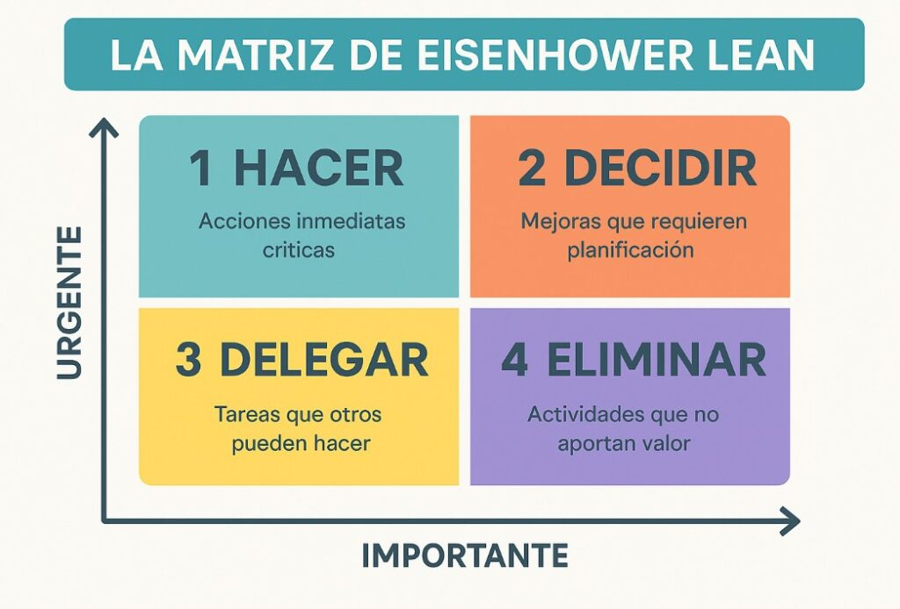

# 4. Estrategias de Gestión del Tiempo y Cumplimiento de Hitos

Uno de los mayores desafíos en la universidad es la sincronización de horarios. Una mala gestión del tiempo suele derivar en entregas de baja calidad realizadas a última hora.

## 4.1 La Técnica de los "Hitos Internos" (Milestones)
Un equipo profesional no trabaja para la fecha de entrega del profesor, sino para sus propias fechas internas:
* **Hito 1 (Investigación):** Finalización de la búsqueda de fuentes.
* **Hito 2 (Borrador):** Primera versión del contenido.
* **Hito 3 (Revisión de Pares):** Control de calidad y formato APA.
* **Hito 4 (Entrega):** Margen de 24-48 horas para imprevistos técnicos.

## 4.2 Métodos de Productividad Sugeridos
* **Técnica Pomodoro Grupal:** Sesiones de trabajo enfocado de 25 minutos con 5 de descanso para evitar el agotamiento.
* **Time Blocking:** Asignar bloques de tiempo específicos en el calendario compartido (Google Calendar) para el trabajo exclusivo del proyecto.

## 4.3 Gestión de Reuniones
Las reuniones largas suelen ser improductivas. Sugerimos el formato **Daily Stand-up** (aunque sea semanal):
1. ¿Qué logré desde la última reunión?
2. ¿Qué voy a hacer hoy?
3. ¿Qué obstáculos me están deteniendo?

## 4.4 Matriz de Eisenhower aplicada al Equipo
Ayuda a distinguir entre lo urgente y lo importante, permitiendo que el equipo se enfoque en las secciones del manual que tienen más peso académico antes de perder tiempo en detalles estéticos secundarios.

